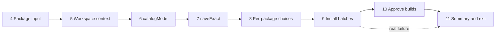

# Installer: combined overview

## Overview

The installer asks which npm packages the user wishes to add, validates them, and installs them with pnpm into the right workspace, dependency type, and catalog. This document merges two specs:

- **Package input and validation** (the existing Step 4 spec, with the amendments in `04-package-input-amendments.md`), which produces a list of validated packages.
- **Catalogs, workspaces and installation** (the catalog spec), split into Steps 5 to 11 below and written in the same format as Step 4. Each step has its own file and hands a small, explicit result to the next one.

## Step map

| # | Step | Spec | Hands off |
| --- | --- | --- | --- |
| 1-3 | Environment checks (intro, pnpm availability, pnpm version) | undecided, see "Environment checks" | nothing |
| 4 | Package input and validation | `INPUT_PACKAGES.md` + `04-package-input-amendments.md` | validated packages, as typed |
| 5 | Workspace context | `05-workspace-context.md` | workspace root and install targets |
| 6 | `catalogMode` | `06-catalog-mode.md` | effective mode, and whether this run saved it |
| 7 | `saveExact` | `07-save-exact.md` | effective value, and whether this run saved it |
| 8 | Per-package choices | `08-package-choices.md` | one choice per package (workspace, dev or prod, catalog) |
| 9 | Install batches | `09-install-batches.md` | result per batch, and packages with unapproved builds |
| 10 | Approve builds | `10-approve-builds.md` | report of approved, denied and pending builds |
| 11 | Summary and exit | `11-summary.md` | exit code |



Step 6 only does real work inside a pnpm workspace. In a plain project it returns immediately, Step 7 still runs, and Step 8 asks only "dev dependency?".

## What each step hands to the next

| From | To | Contents |
| --- | --- | --- |
| 4 | 5-9 | Array of package strings as the user typed them, in validation order |
| 5 | 6, 7, 8, 9 | Workspace root, whether it is a workspace, and the list of targets (label, path, pnpm selector flags) |
| 6 | 8, 11 | Effective `catalogMode` (or unset), and whether this run saved it |
| 7 | 11 | Effective `saveExact` (or unset), and whether this run saved it |
| 8 | 9, 11 | For each package: spec, target, dev or prod, catalog or none, and the existing range if the catalog already had it |
| 9 | 10, 11 | For each batch: installed, failed or skipped; exit code; names with ignored builds; the tail of pnpm's output on failure |
| 10 | 11 | Which of the affected packages were approved, denied or are still pending |

## Cross-cutting decisions

- **Version pinning.** Step 4 validates against the registry but hands on what the user typed. pnpm decides how to record it: a caret by default, an exact version when `saveExact` is true (Step 7). A typed range such as `react@18` is always saved with a caret.
- **Settings steps (6 and 7)** share one pattern: read the project setting, explain it if unset, ask, save with the project location, read back to verify. An explicit value, including a "keep the default" choice, counts as a decision and is never asked about again. A skip is not remembered.
- **pnpm version.** pnpm 12.0.0 or newer.
- **Hidden pnpm output.** From Step 5 on, pnpm runs with its output captured and its input closed. The raw output is shown only when the debug environment variable is set. The one exception is Step 10, which hands the terminal to pnpm on purpose.
- **Cancellation.** Escape and Ctrl+C are the same signal in the prompt library. Steps 5 to 10 treat it as "stop now, install nothing further". Step 4 treats it at the correction prompt as "continue with the valid packages", and its prompt text now says so for both keys.
- **Exit codes.**

  | Situation | Code |
  | --- | --- |
  | Step 4: user picks Exit, or cancel with nothing valid | 1 |
  | Cancel at a prompt in Steps 5 to 10 | dedicated cancel code |
  | A batch fails for a real reason | pnpm's own exit code |
  | Unexpected error anywhere | the fatal exception code |
  | Ignored builds only | 0, since packages were installed |

- **Errors from `main`.** Handled on the promise, so unexpected failures always print a message and exit with the fatal code.
- **Testing seams.** Step 4 is tested in-process with stubbed prompts and registry lookups. Steps 5 to 11 are tested by running the whole CLI as a subprocess against a fixture workspace with a fake `pnpm`, plus a small smoke suite against real pnpm 12. Those tests also pass through Step 4, so they need scripted answers for its prompts.

## Environment checks (Steps 1-3)

Undecided. The idea is to rely on the `engines` field of the tool's own `package.json`:

```
"engines": { "node": ">=24.0.0", "pnpm": ">=12.0.0" }
```

That is worth keeping, but it does not cover the case that matters most here:

- `engines` describes where the tool itself can be installed and run. Its pnpm entry is checked by pnpm for the project whose manifest declares it ("local development"), not for the pnpm binary this tool later starts inside the user's project.
- The tool starts whatever `pnpm` is on the path in the user's project. That can differ from the pnpm the tool was installed with, and a project can ask for its own pnpm version through `devEngines.packageManager`.
- If `pnpm` is missing altogether, starting it fails with a low-level error unless something catches it.

Recommendation: keep `engines` as documentation and for Node, and add one small runtime check before Step 4. It runs `pnpm --version` in the target folder (the exact binary that will be used), exits with a clear message if pnpm is missing, and exits with a clear message if the major version is below 12. Comparing the major number needs no semver library.

## Where the two specs met (findings)

1. **Step 4's resolved versions would have pinned everything.** A bare name was recorded with a caret (`ms` became `^2.1.3`), while `zod@3.23.8` was recorded exactly. Resolved: Step 4 hands on what was typed, and Step 7 offers `saveExact`.
2. **`react@18@18.3.1` breaks pnpm**, and a failed add can still leave a broken entry in the workspace file. Step 4 must never glue the resolved version onto the typed input, and the summary should tell the user to review the workspace file after a failure.
3. **Escape and Ctrl+C are the same signal**, which is why Step 4's prompt text now mentions both.
4. **The registry lookup returns an object only because the JSON helper appends `name`.** Keep that.
5. **`saveExact` is stored in the workspace settings file, in plain projects too.** Saving it creates the file, which turns a plain project into a root-only workspace for later runs (see decision E2).
6. **Result order matters.** Step 8 asks its questions in Step 4's result order, so packages fixed in a later correction round come last.

## Decisions needed

- **E1. Environment checks.** Keep `engines` and add the small runtime check described above? *Recommendation: yes.*
- **E2. Plain projects and `saveExact`.** Offer `saveExact` in a plain project even though saving it creates `pnpm-workspace.yaml`, which makes later runs treat the project as a workspace (catalog questions appear)? *Recommendation: yes, and mention the new file in the summary.* pnpm itself already treats such a project as a workspace with catalogs.
- **E3. "No, keep caret ranges".** Store this as an explicit `saveExact: false`, so the question never returns? *Recommendation: yes, mirroring the explicit `manual` choice for `catalogMode`.*

## Out of scope for the whole installer

- Peer, optional or other dependency types.
- Version resolution, compatibility checks, and registries other than the default.
- Using catalogs in a project that is not a workspace.
- Editing the workspace settings file ourselves, or moving existing dependencies into catalogs.
- Any version-prefix setting other than `saveExact`.
