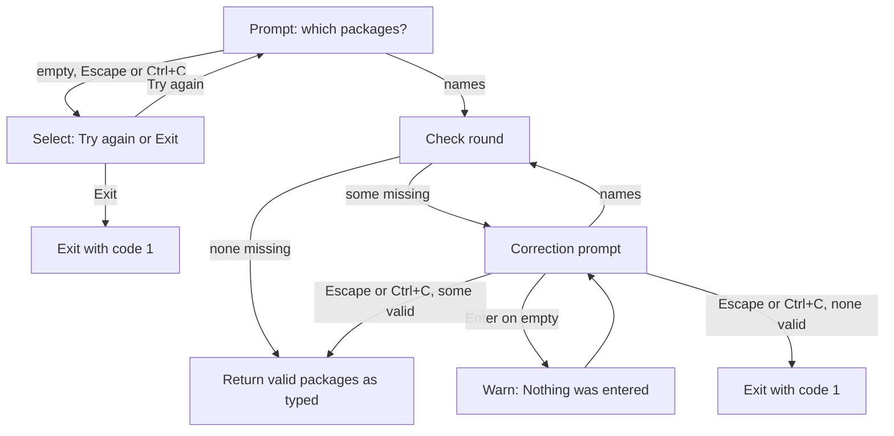

# Package input and validation (Step 4)

## Overview

Step 4 of the installer asks the user which npm packages to install, checks each one against the npm registry, and lets the user fix typos or add more packages until they are done. The result is a list of validated package strings, **exactly as the user typed them** (for example `react` or `react@18`), handed to the next step. Later steps decide how pnpm records the version.

The flow is driven by two exported functions:

- `getPackages` asks for packages the first time.
- `checkPackages` validates them and runs the correction loop.

## Goals

- Never send a registry request twice for a package that already validated successfully.
- Let the user correct typos in place instead of retyping the whole list.
- Treat an empty submission as "the user hasn't decided yet", not as an error or a reason to quit.
- Keep Escape (or Ctrl+C) as the one explicit way to say "continue with what is valid".
- Hand on what the user typed, so that pnpm and the `saveExact` setting (Step 7) decide how versions are recorded, instead of pinning every package to the version resolved here.

## User stories

1. As a user, I want to enter several package names separated by spaces or commas so that I can type them in whatever style I prefer.
2. As a user, I want CLI-style flags in my first answer to be ignored so that pasting a full installation command doesn't break validation.
3. As a user, I also want point number 2 to be communicated to me clearly. I want to be informed that I can't provide any flags as they will be just filtered out.
4. As a user, I want as less visual noise as posible, so after getting the note about flags for the first time, I don't want to see it again, even if I accidentally enter some extra flag.
5. As a user, I want to be able to exit the application at any moment. It doesn't matter if there are packages (valid or not) Ctrl+C should terminate the installation process.
6. But, as a user, I would expect that if I have at least one valid package, and on the next correction prompt I press `Escape`, this valid should continue installing.
7. As a user, if I didn't provide packages as cli args, I want to be offered a text field to enter then separate by spaces or commas.
8. As a user, if I didn't type anything or just pressed Enter or Escape, I want a radio button select to appear, asking me if I want to try again or exit.
9. As a user, if I choose "try again", I want text input to appear again, an so on.
10. As a user, if I choose "exit" or press Ctrl+C, I want the application to terminate. Pressing Escape ideally should just move you to the next step and only terminate the program if there's not enough data for the next step
3. As a user, I want to see which packages were found and which were not, so that I know what needs fixing.
4. As a user, I want the missing packages prefilled in the correction prompt, so that I can fix a typo without retyping everything.
5. As a user, I want to add more packages while correcting, so that I don't need a separate prompt for additions.
6. As a user, I want packages that already validated to be skipped when I re-enter them, so that corrections are fast.
7. As a user, I want pressing Enter on an empty correction prompt to ask me again, so that an accidental keypress doesn't end the flow.
8. As a user, I want Escape to continue with the valid packages, so that I can give up on a package I can't fix.
9. As a user who enters nothing at the start, I want to choose between trying again and exiting, so that I can recover from a mistake or leave cleanly.
10. As a user, I want the flow to end automatically once every package is valid, so that I don't need an extra confirmation.
11. As a user, I want to type a version or tag such as `react@18` or `react@latest`, so that I can ask for a specific version range.
12. As a user, I want my input passed on as I typed it, so that the version is recorded the way my settings say (caret, or exact with `saveExact`).

## Flow

## Behavior

### Initial prompt

- Message: "Which packages do you want to install? You can enter space- or comma-separated list of names", with `react react-router` as a placeholder.
- The answer is split on commas and any whitespace, and flags are removed.
- Each entry may include a version range or tag (`react@18`, `react@latest`).
- Escape at this prompt is treated the same as an empty answer. 

### Nothing entered

Shown whenever there are no packages and nothing is waiting to be corrected: after an empty initial prompt, or when `checkPackages` is called with an empty list.

- A select asks: "You haven't specified any packages to install. Would you like to try again or exit?"
- **Try again** goes back to the initial prompt.
- **Exit** prints "Good bye, See you," and exits with code 1.

### Check round

- Duplicates within one submission are collapsed, so each distinct typed entry causes at most one registry request.
- Entries that already validated in an earlier round are skipped.
- Remaining entries are checked in parallel.
- Each entry is checked by asking the registry for the version of exactly what was typed. `react@18` is valid if some version matches that range. An entry that matches nothing counts as missing.
- The resolved version is used only for display and for remembering that the entry validated. It is never added to the typed text.
- After the round, all valid packages so far are listed under "Found packages", each shown with the version it resolved to. If any failed, the new failures are listed under "Missing packages".
- If nothing is missing, the flow ends and returns the valid packages.

### Correction prompt

Shown only when at least one package is missing.

- Message: "Correct the missing packages or add more. Press `Escape` or `Ctrl+C` to continue with the valid packages."
- The input is prefilled with the missing packages, space-separated.
- **Names submitted:** they become the next round's submission. Missing packages that the user removed from the input are dropped.
- **Empty submission:** warns "Nothing was entered." and shows the prompt again, prefilled with the same missing packages. No registry requests are made.
- **Escape or Ctrl+C with at least one valid package:** returns the valid packages. Missing ones are dropped.
- **Escape or Ctrl+C with no valid packages:** prints "No valid packages were provided." and exits with code 1.

### Result

An array of the validated entries **as the user typed them**, in the order they were validated (within a round, the order the user typed them). The resolved versions are not part of the result.

If the user typed the same package in two forms (`react` and `react@18`), both are kept.

## Scenarios

| Situation | Outcome |
| --- | --- |
| All entered packages exist | "Found packages" list, flow ends |
| Some packages don't exist | Found list, Missing list, correction prompt prefilled with the missing ones |
| User fixes the typos | Only the new entries are checked, flow ends if all are valid |
| User enters only already-valid entries | Nothing is checked, nothing is missing, flow ends |
| Enter on an empty correction prompt | "Nothing was entered." and the same prompt again |
| Escape or Ctrl+C at the correction prompt, some valid | Returns the valid packages |
| Escape or Ctrl+C at the correction prompt, none valid | Exit code 1 |
| Empty input, Escape or Ctrl+C at the initial prompt | Try again / Exit select |
| Same entry typed twice in one answer | One registry request |
| Flags in the initial answer | Ignored |
| `react@18` and the range matches a version | Valid, returned as `react@18` |
| `react@18` and nothing matches | Reported as missing |
| `react` and `react@18` typed together | Two entries, both kept, both returned |

## Implementation decisions

- Validation state is a map from the entry the user typed to the version it resolved to. This is what guarantees a valid entry is never checked again. The returned list is the map's keys, in insertion order.
- The resolved version is never appended to the typed text. A string like `react@18@18.3.1` is rejected by pnpm, and in testing pnpm still wrote a broken entry into the workspace file before failing.
- The registry lookup helper must keep appending `name` to the request. A version lookup on its own returns a bare string, but with `name` appended it returns an object with `version` and `name`, which is the shape this step relies on.
- The correction loop is a `while` loop, not recursion, so there is no depth growth and "until Escape" is explicit in the control flow.
- "Missing" is tracked per round. Anything the user doesn't resubmit stops being missing. The previous missing list is only kept across an empty submission.
- The try-again-or-exit select is one shared helper used by both exported functions.
- `checkPackages` calls `getPackagesFromUserInput` when it has nothing to check and nothing to correct, so both entry points reuse the same prompt and select.
- `checkPackages` takes only `packages`. The previous `found` option existed solely for recursion and was removed.
- Parsing of an answer is one helper: split on commas and whitespace, drop empty strings, collapse duplicates.
- Escape and Ctrl+C are the same signal in the prompt library and cannot be told apart. At the correction prompt both mean "continue with the valid packages". This is accepted, and the prompt text names both keys. Later steps treat cancel as "stop", and the user can cancel again there.
- Exit conditions use exit code 1: choosing Exit in the select, and Escape or Ctrl+C with no valid packages.
- Messages say "packages", not "projects".

## Testing decisions

- Test external behavior: the returned list, how many registry lookups each entry causes, and whether the process exits. Don't assert on internal state.
- Stub the prompt library (text, select, and a cancel signal for Escape and Ctrl+C) and the registry lookup. Stub process exit so it can be observed.
- Cover every row in the scenarios table, plus:
  - a package fixed in round two doesn't cause re-checks of round-one packages;
  - several empty submissions in a row keep re-prompting with the same prefill;
  - a mix of commas and whitespace parses correctly;
  - the returned array contains the typed strings, not the resolved versions;
  - a typed range that exists is returned as typed, and one that matches nothing is reported as missing.
- The end-to-end tests of the later steps also pass through this step, so they need scripted answers for its prompts.

## Open questions

1. **Tags.** Entries such as `react@latest` are expected to validate like ranges but have not been tested against the registry helper.
2. **Flags in the correction prompt.** The initial prompt strips flags, the correction prompt does not. Decide whether to make them consistent.
3. **Result order.** Packages fixed in a later round appear after ones validated earlier, not in the user's original position. Step 8 asks its per-package questions in this order.
4. **Select on an empty correction prompt.** Deliberately not used, because "Exit" would discard valid packages and Escape or Ctrl+C already covers that. Revisit if the select is wanted there too.
5. **Escape or Ctrl+C at the select.** Behavior depends on the shared prompt-unwrapping helper, which this spec doesn't change.

## Out of scope

- Installing the packages (the later steps).
- Deciding how a version is recorded: caret or exact (Step 7 and Step 9).
- Version resolution beyond checking that the typed entry matches something, peer dependencies, and compatibility checks.
- Registries other than the default one used by the package manager helper.
- Offline or network-failure handling beyond how a failed lookup is already reported as "missing".
