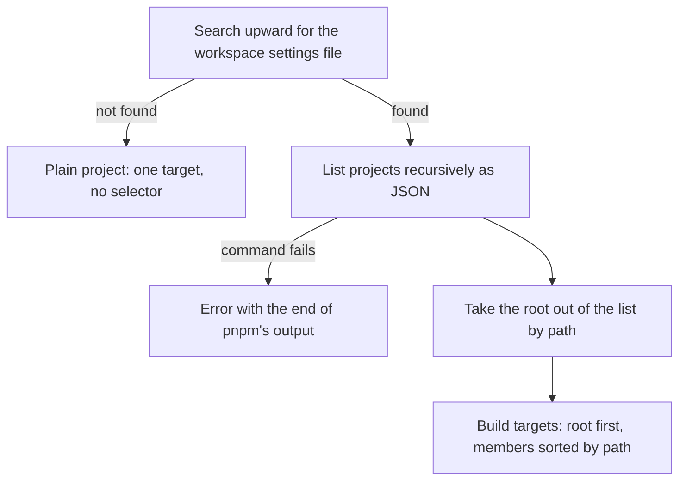

# Workspace context (Step 5)

## Overview

Step 5 finds out whether the project is a pnpm workspace and, if so, which projects packages can be installed into. It asks the user nothing. Its result is used by every later step: Step 6 and Step 8 only ask catalog and workspace questions inside a workspace, and Step 9 runs every pnpm command from the workspace root. Step 7 (`saveExact`) works in both kinds of project, but writes to the workspace settings file, which pnpm creates if it is missing; from then on the project counts as a workspace here.

Input: nothing from earlier steps except the working directory.
Output: the workspace root, whether this is a workspace, and an ordered list of install targets.

## Goals

- Offer the root and every member project as install targets, each exactly once.
- Make targets easy to tell apart in a prompt, even when projects have no name or share a name.
- Behave sensibly in a plain, non-workspace project.

## User stories

1. As a user, I want the root of the workspace offered alongside the member projects, so that I can add root-level tooling.
2. As a user, I want the root shown only once, whether or not pnpm lists it, so that the list isn't confusing.
3. As a user, I want each target labelled with the project's name (or folder name if it has none) and its path relative to the workspace root, so that I can tell similar projects apart.
4. As a user, I want the root labelled clearly as the root, so that I don't confuse it with a member.
5. As a user in a plain project, I want no workspace questions, so that I'm not asked about things that don't apply.
6. As a user running the tool from inside a member folder, I want the workspace root to be found anyway, so that installs go where I expect.

## Flow

## Behavior

### Finding the root

- Starting at the working directory and walking up, the first directory that contains the workspace settings file is the workspace root.
- If none is found, the project is not a workspace. The only target is the working directory, with no selector flags.

### Listing projects

- Inside a workspace, projects come from pnpm's recursive project listing in JSON mode, run from the root. Each entry has a path and, if the project has one, a name.
- Whether pnpm includes the root in that list depends on the version, so the root is identified by path and every other entry is a member.

### Targets

| Target | Label | How pnpm is told to use it |
| --- | --- | --- |
| Root | `name (root)`, with the folder name if the root has no name | the workspace-root flag |
| Member with a unique name | `name (/relative/path)` | filter by name |
| Member without a name | `folder (/relative/path)` | filter by relative path |
| Member whose name another project shares | `name (/relative/path)` | filter by relative path |
| Plain project | folder name | no flag |

Paths in labels are relative to the workspace root, use forward slashes and start with a slash. Members are sorted by path.

## Scenarios

| Situation | Outcome |
| --- | --- |
| Workspace with members | Root plus members as targets |
| Workspace where pnpm also lists the root | Root appears once |
| Workspace with no members | Root is the only target |
| Member without a name | Folder name as label, path filter |
| Two members with the same name | Both labelled with their own path, path filter |
| Tool started inside a member folder | Root found by walking up |
| Plain project | One target, no workspace questions later |
| Listing fails | Error with the last lines of pnpm's output, run stops |

## Implementation decisions

- The workspace root is found by looking for the settings file, not by asking pnpm, so a plain project never triggers a listing call.
- The root is identified by path so the result is the same whether or not pnpm lists it (verified: pnpm 12.8.1 lists it, while an earlier observation said it doesn't).
- Filtering by a name that two members share would install into both (verified), so name filtering is used only for unique names.
- Filtering by relative path works for unnamed members (verified).
- Every later pnpm command runs with the workspace root as its working directory, which is what makes relative path filters correct.

## Testing decisions

- Assert on the resulting targets: labels, order and selector flags. Do not assert on how the listing was parsed.
- Use fixture workspaces for: root listed and not listed, no members, unnamed member, duplicate names, started from a nested folder, plain project, failing listing.

## Open questions

1. A member without a name whose folder name equals another member's name gets a path filter and a label that differ only by path. Fine today, but worth a look if labels are ever shortened.
2. A project with a very long relative path makes a long prompt label. No truncation is planned.

## Out of scope

- Choosing among targets (Step 8).
- Detecting nested or multiple workspaces beyond the nearest settings file.
- Creating a workspace from a plain project.
