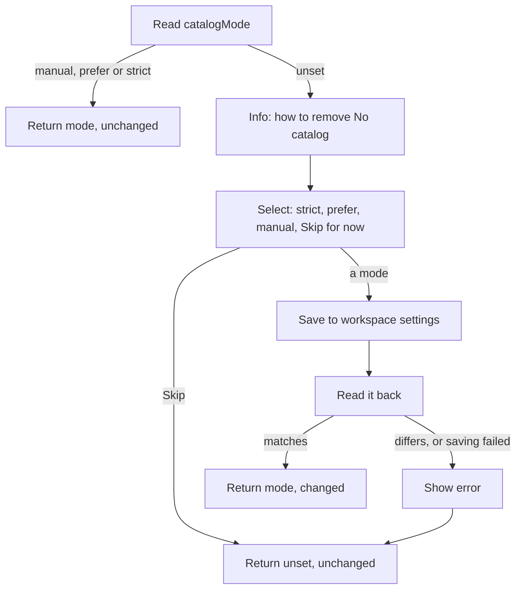

# catalogMode (Step 6)

## Overview

Step 6 checks pnpm's `catalogMode` setting for the workspace. If it has never been set, it explains what the setting does and offers to set it. The result decides whether Step 8 may offer a "No catalog" option.

Runs only inside a workspace. In a plain project it is skipped.

Input: the workspace root from Step 5.
Output: the effective mode (or "unset"), and whether this run saved a new one.

## Goals

- Nudge people toward enforcing catalogs without forcing it.
- Never nag someone who has already decided, including those who explicitly chose `manual`.
- Change only the workspace's own settings, never the user's global pnpm config.

## User stories

1. As a user whose `catalogMode` is unset, I want an explanation that "No catalog" can be removed by setting `catalogMode` to `strict` (recommended) or `prefer`, so that I understand how to change it.
2. As a user, I want that explanation to say briefly what `strict` does (only versions that satisfy the catalog are accepted), so that I can decide knowingly.
3. As a user whose `catalogMode` is unset, I want to be asked whether to set it now, with `strict`, `prefer`, `manual` and "Skip for now", so that I can configure it without leaving the tool.
4. As a user who picks a mode, I want it saved in the workspace's own settings, so that it applies to the whole team and nothing else on my machine changes.
5. As a user who picks a mode, I want the tool to verify it was saved and tell me clearly if it wasn't, so that I'm not misled.
6. As a user who picks a mode, I want the explanation and prompt never shown again, so that I'm not nagged.
7. As a user who picks a mode during this run, I want the rest of this run to reflect it immediately, so that "No catalog" disappears right away.
8. As a user who explicitly set `manual`, I want to be treated as having decided, so that I'm never asked.
9. As a user who skips, I want to be asked again next time, so that I can decide later.

## Flow

## Behavior

- **Reading.** pnpm prints `null` when the setting isn't set (verified). Only that counts as "unset". An explicit `manual` is a decision.
- **Explanation.** One info message: "No catalog" can be removed by setting `catalogMode` to `strict` (recommended) or `prefer`, plus one line saying `strict` only accepts versions that satisfy the catalog.
- **Prompt.** "Do you want to set catalogMode now?" with `strict (recommended)`, `prefer`, `manual` and "Skip for now".
- **Saving.** The chosen mode is written with pnpm's config command using the project location, then read back. If the command fails or the value read back differs, an error is shown and the run continues as if unset.
- **Skip.** Nothing is saved, so the explanation and prompt come back on the next run.
- **Effect on Step 8.** "No catalog" is offered only when the effective mode is unset or `manual`.

## Scenarios

| Situation | Outcome |
| --- | --- |
| Mode unset, user picks `strict` | Saved and verified, "No catalog" hidden from now on |
| Mode unset, user picks `manual` | Saved, "No catalog" still offered, never asked again |
| Mode unset, user skips | Nothing saved, asked again next run, "No catalog" offered |
| Mode already `prefer` or `strict` | No message, "No catalog" hidden |
| Mode already `manual` | No message, "No catalog" offered |
| Saving fails or reads back differently | Error shown, run continues with mode unset |
| Plain project | Step skipped |
| Cancel at the select | Run stops, nothing installed (a mode saved earlier in this run stays) |

## Implementation decisions

- The project location is always used when saving (verified: it writes into the workspace settings file and reads back).
- Reading back after saving is how "verify it was saved" is done; no separate file check.
- Failure to save is reported, not fatal, because the install itself doesn't depend on it.
- The skip choice is not remembered anywhere, on purpose (no tool config for this).
- Saving via pnpm changed the workspace file's permissions to owner-only in testing. That is pnpm's behavior and is not worked around.

## Testing decisions

- Assert on the prompts shown, the effective mode returned, and the workspace setting afterwards.
- Cover every row of the scenarios table, with a fake pnpm whose config reads and writes can succeed, fail or disagree.

## Open questions

1. The owner-only file permissions after saving may surprise teams that share a checkout. Decide whether a note is wanted.
2. `prefer` and `strict` mainly govern the default catalog; they do not stop pnpm from accepting a package into a named catalog. Hiding "No catalog" under `prefer` is a product rule, not something pnpm enforces.

## Out of scope

- Changing `catalogMode` after the first run, other than by editing the workspace settings.
- Remembering that the user skipped the prompt.
- Any other pnpm setting.
