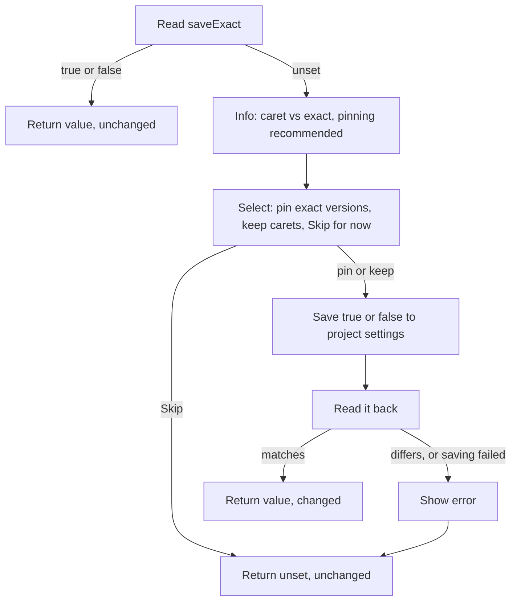

# saveExact (Step 7)

## Overview

By default pnpm saves a new dependency with a caret (`^1.2.3`), which allows minor and patch upgrades. Pinning exact versions is now widely considered the safer practice. Step 7 checks pnpm's `saveExact` setting. If it has never been set, it explains the trade-off and offers to turn it on, so that every package from this run (and later runs) is saved with an exact version.

Runs in workspaces and in plain projects. It runs before any package question, so the answer applies to this run's installs.

Input: the workspace root (or the project folder in a plain project) from Step 5.
Output: the effective `saveExact` value (or "unset"), and whether this run saved it.

## Goals

- Steer people toward pinned versions without forcing it.
- Ask once, and never nag someone who has decided either way.
- Change only the project's own settings, never the user's global pnpm config.

## User stories

1. As a user whose `saveExact` is unset, I want to be told that packages will be saved with a caret and that pinning is recommended, so that I understand what I'm getting.
2. As a user, I want to be asked whether to turn on `saveExact` now, so that I can pin all versions without leaving the tool.
3. As a user who says yes, I want it saved in the project's own settings, so that it applies to the whole team and nothing else on my machine changes.
4. As a user who says yes, I want this run's packages saved with exact versions, so that I don't have to run anything twice.
5. As a user who keeps carets, I want that remembered, so that I'm never asked again.
6. As a user who skips, I want to be asked again next time.
7. As a user who already set `saveExact` to true or false, I want no question at all.
8. As a user, I want the tool to verify the setting was saved and tell me if it wasn't.

## Flow

## Behavior

- **Reading.** pnpm prints `null` when the setting isn't set, and `false` when it was explicitly set to false (both verified). Only `null` means "unset".
- **Explanation.** One info message, along the lines of: "All packages will be saved with a caret (^), which allows minor and patch upgrades. This is not considered best practice. We highly recommend setting `saveExact` to `true` in your `pnpm-workspace.yaml` so that all versions are pinned."
- **Prompt.** "Do you want to pin exact versions?" with:
  - "Yes, pin exact versions (recommended)", which saves `true`;
  - "No, keep caret ranges", which saves `false` so the question is not asked again;
  - "Skip for now", which saves nothing.
- **Saving.** Written with pnpm's config command and the project location, then read back. If the command fails or the value differs, an error is shown and the run continues as if unset.
- **Effect on installs.** With `saveExact` true, a bare package name is saved exactly in `package.json` and in catalog entries alike (verified). A package typed with a range, such as `react@18`, is still saved with a caret (verified), because the user asked for a range.

## Scenarios

| Situation | Outcome |
| --- | --- |
| Unset, user picks "pin" | `saveExact: true` saved and verified; this run's packages are exact |
| Unset, user picks "keep carets" | `saveExact: false` saved; never asked again |
| Unset, user skips | Nothing saved; asked again next run; carets used |
| Already true or already false | No message, no prompt |
| Saving fails or reads back differently | Error shown, run continues with carets |
| Plain project, user picks "pin" | Setting saved; pnpm creates the workspace settings file |
| `react@18` typed with `saveExact` true | Saved as `^18.x` |
| Cancel at the select | Run stops, nothing installed (a setting saved earlier in this run stays) |

## Implementation decisions

- Same shape as Step 6: read, explain, ask, save, verify. Only the setting and the wording differ, so the two steps can share one helper for reading and saving a project setting.
- "Keep caret ranges" is stored as an explicit `false`, the same way an explicit `manual` counts as a decision for `catalogMode`.
- In a plain project the project location makes pnpm create the workspace settings file (verified). The effect is the same as in Step 10 (approving builds): the project is a root-only workspace from the next run.
- The step runs before the per-package questions and before any installs, so the setting is already in place when pnpm adds packages.

## Testing decisions

- Assert on the prompt shown, the value returned, the setting afterwards, and the version recorded for a bare name.
- Cover every row of the scenarios table with a fake pnpm whose config reads and writes can succeed, fail or disagree, plus one smoke test against real pnpm 12 for the exact and caret outcomes.

## Open questions

1. **Plain projects.** Saving the setting creates a workspace settings file, which turns the project into a root-only workspace for later runs. Recommendation: accept this (pnpm itself treats it as a workspace and supports catalogs there) and mention the new file in the summary.
2. **Wording.** The original wording said carets allow "patch" upgrades; a caret also allows minor ones, so the message says "minor and patch".
3. **File permissions.** Saving via pnpm made the settings file owner-only in testing (as with Step 6).

## Out of scope

- `savePrefix` and other version-prefix settings.
- Rewriting versions that are already saved with a caret.
- Remembering a skip.
