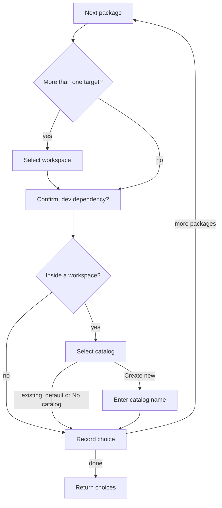

# Per-package choices (Step 8)

## Overview

Step 8 asks, for every package from Step 4, where it should go: which workspace, whether it is a dev dependency, and which catalog (or none). It produces one choice per package and nothing is installed yet.

Input: the packages from Step 4 (as the user typed them, for example `react` or `react@18`), the targets from Step 5, the effective `catalogMode` from Step 6, and the existing catalogs and their contents.
Output: one choice per package.

## Goals

- Make every package's destination explicit, with no "apply to all" shortcuts.
- Keep repeated answers cheap by pre-selecting the previous package's answers.
- Let users create catalogs on the spot instead of planning names in advance.

## User stories

1. As a user, I want to choose the workspace for each package, so that every dependency lands in the project that uses it.
2. As a user, I want to say whether each package is a dev dependency, so that it ends up in the right field.
3. As a user, I want the questions asked in the same order for every package (workspace, dev or prod, catalog), so that the flow is predictable.
4. As a user installing several packages, I want my previous answers pre-selected, so that repeating a choice is just Enter.
5. As a user, I want to choose a catalog from the existing ones, the `default` catalog (even if it doesn't exist yet), or a new one, so that every package has an explicit home.
6. As a user, I want to create a new catalog in the middle of the flow, and reuse it for later packages.
7. As a user, I want catalog names validated, so that I can't create a name that breaks the workspace file.
8. As a user, I want `default` rejected as a new name, so that it can't be confused with the built-in catalog.
9. As a user, I want typing the name of an existing catalog to simply reuse it with a short note, so that a harmless mistake doesn't block me.
10. As a user, I want catalogs that already contain a package to show a hint with its current range, so that I can avoid duplicates.
11. As a user, I want a "No catalog" option when my workspace allows it, so that I can install a dependency directly.
12. As a user in a plain project, I want only the dev or prod question.

## Flow

## Behavior

- **Workspace prompt.** "Which workspace should `<package>` be installed in?" listing the targets from Step 5. It is skipped only when there is exactly one target (a plain project, or a workspace with no members). With members it is always shown, even for one package.
- **Dev prompt.** "Is `<package>` a dev dependency?" yes or no. Peer and optional types are not offered.
- **Catalog prompt.** Options, in order: `default` (always, even if it doesn't exist yet), the other existing catalogs, catalogs created earlier in this run, "＋ Create new catalog", and "No catalog" when allowed. Existing catalogs that already contain the package show a hint such as "has lodash@^4.17.0".
- **"No catalog" is allowed** when the effective `catalogMode` is unset or `manual`.
- **Pre-selection.** Each prompt starts on the previous package's answer, as long as that answer is still a valid option.
- **New catalog names.** Lowercase letters, digits, `.`, `_` and `-`, starting with a letter or digit. `default` is rejected. A name that matches an existing catalog, or one created earlier in this run, is reused with an info note.
- **Plain projects.** No catalog prompt, and the choice's catalog is "none".
- **Existing range.** If the chosen catalog already contains the package, the range is recorded on the choice so the summary can mention it.

## Scenarios

| Situation | Outcome |
| --- | --- |
| Workspace with members, one package | Workspace, dev and catalog prompts all appear |
| Root-only workspace | Workspace prompt skipped |
| Plain project | Only the dev prompt |
| Second package | Each prompt starts on the first package's answers |
| Create a new catalog, then pick it for the next package | New name appears in the list |
| Type `default` as a new name | Rejected |
| Type an existing catalog's name | Reused with a note |
| `catalogMode` is `strict` or `prefer` | No "No catalog" option |
| `catalogMode` unset or `manual` | "No catalog" option present |
| Cancel at any prompt | Run stops, nothing installed |

## Implementation decisions

- Catalog names come from the existing-catalogs helper (which treats the singular and plural default definitions as the same `default`). Contents come from pnpm's config reads, which tolerate empty or failing reads.
- Catalogs are never created by the tool. A new name is only recorded; pnpm creates the entry during the install (Step 9).
- The prompts run package by package in Step 4's result order.
- A cancel at any prompt exits before anything is installed.

## Testing decisions

- Assert on which prompts appear and what options they list, the pre-selected values, and the choices returned.
- Cover: skipped and shown workspace prompt, dev answers, pre-selection across packages, each catalogMode variant for "No catalog", name validation, existing-name reuse, hints, plain project, cancellation at each prompt.

## Open questions

1. Many packages means many prompts, since there are no bulk options. Revisit if this proves tedious in practice.
2. Packages are asked about in Step 4's order, so ones fixed in a later correction round come last (Step 4's open question 4).

## Out of scope

- Bulk "apply to all packages" answers.
- Peer, optional or other dependency types.
- Moving packages that are already installed into catalogs.
