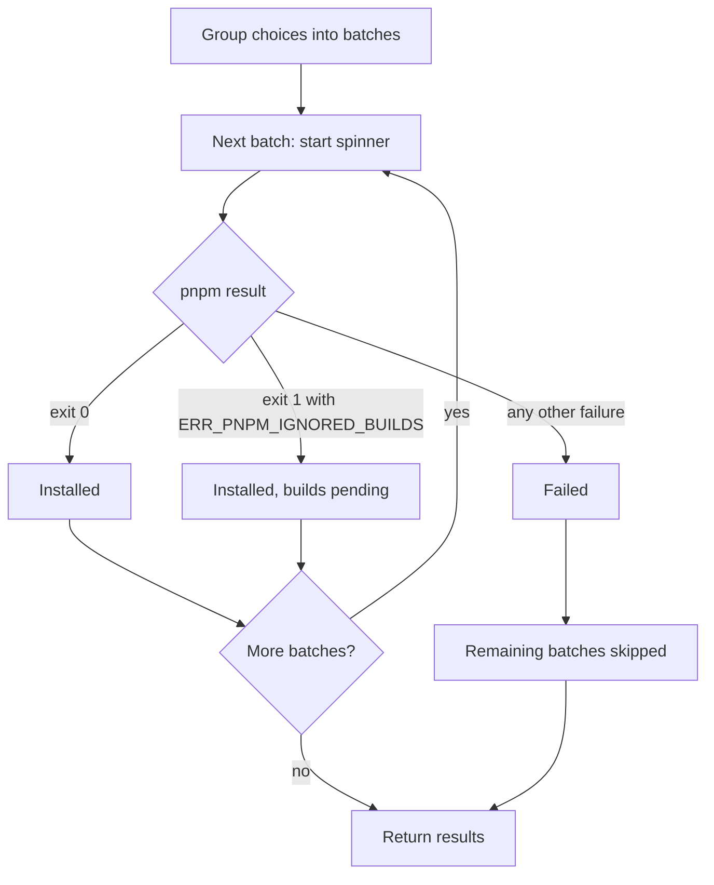

# Install batches (Step 9)

## Overview

Step 9 turns the per-package choices into pnpm installs. Packages with the same workspace, dependency type and catalog are installed together in one batch. pnpm's own output is hidden; the user sees a spinner naming what is being installed. The result of each batch is handed to the next steps.

Input: the choices from Step 8 and the workspace root from Step 5.
Output: a result for each batch, and the names of packages whose build scripts are not yet approved.

## Goals

- Run as few pnpm commands as possible.
- Keep the screen clean while still showing what is happening.
- Never let pnpm hang waiting for input nobody can see.
- Treat unapproved build scripts as an outcome to handle later, not as a failure.

## User stories

1. As a user, I want packages with identical workspace, type and catalog answers installed together, so that installs are fast.
2. As a user, I want packages for the root installed at the root, and packages for a member installed in that member only.
3. As a user, I want `default` catalog packages to use pnpm's default-catalog behavior and other catalogs to use the named behavior, so that they land in the right place.
4. As a user, I want pnpm to create any new catalog entry itself, so that my workspace file and its comments are never rewritten by the tool.
5. As a user, I want pnpm's output hidden, so that the screen stays clean.
6. As a user, I want a spinner that names the packages and where they are going.
7. As a user debugging an install, I want a way to see pnpm's raw output.
8. As a user, I want pnpm unable to hang waiting for hidden input.
9. As a user, I want a failed install to keep the relevant part of pnpm's error for the summary.
10. As a user, I want the remaining batches skipped after a real failure, and the tool to exit with a failure code, so that scripts and CI notice.
11. As a user who asks for a version outside what a strict catalog allows, I want pnpm's mismatch error shown, so that I know why it was rejected.
12. As a user, I want packages with ignored build scripts treated as non-fatal, so that the other batches still install.

## Flow

## Behavior

### Grouping

- Batches are keyed by (catalog or none, workspace, dev or prod) and run one after another, in the order each key first appears.

### The pnpm command

| Part | Rule |
| --- | --- |
| Target | Root: workspace-root flag. Member: filter by name or by path (from Step 5). Plain project: nothing |
| Type | Dev: the dev flag |
| Catalog | `default`: the default-catalog flag. Another name: the named-catalog flag with that name. None: no catalog flag |
| Packages | Appended exactly as the user typed them in Step 4, so pnpm applies its own version prefix |

### Running

- pnpm runs from the workspace root. Its output is captured and its input is closed, so a prompt from pnpm fails fast instead of hanging.
- A spinner shows `Installing <packages> → <workspace> · <dev or prod> · <catalog or "no catalog">`, then a success or failure line.
- With the debug environment variable set, the raw output is streamed and the spinner is replaced by plain step lines.

### Outcomes

| pnpm result | Outcome |
| --- | --- |
| Exit 0 | Installed |
| Exit 1 with `ERR_PNPM_IGNORED_BUILDS` | Installed, with builds pending. Package names are read from pnpm's message |
| An "Ignored build scripts" warning with exit 0 | Installed, with builds pending |
| Any other failure | Failed. The last lines of output are kept. The remaining batches are skipped |

## Scenarios

| Situation | Outcome |
| --- | --- |
| Four packages, three distinct answer sets | Three batches |
| Root package in the default catalog, dev | One command with the root flag, the dev flag and the default-catalog flag |
| Member with an unnamed project | Filter by path |
| A batch hits ignored builds, another follows | Both run; builds marked pending |
| Strict mode and a version outside the catalog | Failed with pnpm's mismatch error; later batches skipped |
| pnpm asks a question | Fails fast instead of hanging |
| Debug variable set | pnpm output streamed, no spinner |

## Implementation decisions

- Ignored builds are not a failure because pnpm still installs the package and updates the manifest (verified), even though it exits with code 1.
- With `catalogMode` at `manual`, a requested version that differs from a catalog entry installs as a direct dependency without any warning (verified). In `strict` it fails with a version mismatch error (verified). The tool adds no pre-install warning for either.
- Filtering by a shared name would hit every project with that name (verified), so Step 5 gives such projects a path filter.
- All commands run from the workspace root so relative path filters resolve.
- With `saveExact` set to true, a bare name is recorded exactly, in manifests and in catalogs alike. A typed range such as `react@18` is still recorded with a caret (both verified). Without `saveExact`, bare names get a caret.

## Testing decisions

- Assert on the pnpm commands issued (arguments and order), the spinner or step text, the batch results, and the exit code.
- Use a fake pnpm that can succeed, fail, or fail with the ignored-builds error, plus a smoke suite against real pnpm 12.
- Cover each scenario above, plus several batches where only a middle one fails.

## Open questions

1. **Partial changes after a failure.** A failed add of a malformed package spec still wrote an entry into the workspace file (verified once). Recommendation: when any batch fails, the summary adds a line asking the user to review the workspace file.
2. **Spinner in non-interactive terminals.** It prints each update on its own line. Cosmetic only.
3. **Pinned versions.** Resolved by Step 4 and Step 7: packages are passed on as typed, and pinning is controlled by the `saveExact` setting.

## Out of scope

- Retrying failed batches.
- Any pnpm prompt other than build approval (Step 10).
- Installing in parallel.
