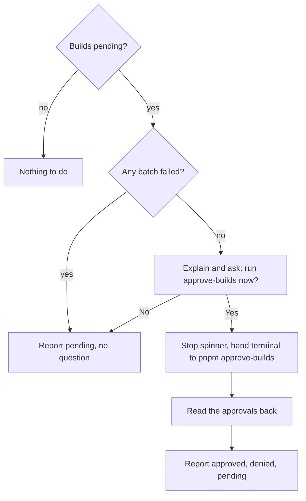

# Approve builds (Step 10)

## Overview

Some dependencies run scripts when they are installed, and pnpm 12 refuses to run them until the user approves them. Step 9 collects the packages affected. Step 10 explains this once, after all batches have run, and offers to run pnpm's own approval flow.

Input: the batch results from Step 9 and the workspace root.
Output: a report of which packages were approved, denied or are still pending.

## Goals

- Ask once, at the end, instead of interrupting each batch.
- Use pnpm's own picker, so the user chooses exactly what to approve.
- Make sure approved scripts actually run.

## User stories

1. As a user, I want to be asked once, after all batches have run, whether to approve dependency builds.
2. As a user, I want the CLI to explain in its own words why approval is needed and list the affected packages.
3. As a user who says yes, I want to use pnpm's interactive picker with full terminal control.
4. As a user who approves builds, I want the approved scripts to actually run, so that I don't need a second install.
5. As a user who says no, I want to be told the manual command later.
6. As a user, I want to see afterwards which packages were approved, denied and still undecided.
7. As a user whose install failed for a real reason, I don't want to be asked about builds, so that I can deal with the failure first.

## Flow

## Behavior

- **Condition.** The step runs only if at least one batch reported ignored builds and no batch failed.
- **Explanation.** A warning saying some dependencies need to be allowed to run their build scripts, with the package names if they could be read.
- **Question.** "Do you want to run pnpm approve-builds now?", defaulting to yes.
- **Yes.** The terminal is handed to pnpm's own approval command, run from the workspace root. pnpm's picker takes over the screen. pnpm 12 runs the approved builds as part of approval, so there is no separate rebuild step (verified).
- **After approval.** The approval settings are read back. Each affected package is reported as approved, denied, or pending if undecided.
- **No.** Nothing runs. The report lists all affected packages as pending.
- **Cancelling inside pnpm's picker** leaves the packages pending; it doesn't stop the tool.

## Scenarios

| Situation | Outcome |
| --- | --- |
| No ignored builds | Step does nothing |
| Ignored builds, user says yes and approves all | Approved list, builds already run |
| User approves some and denies others | Approved and denied lists |
| User says no | All pending, manual command shown in the summary |
| User cancels inside pnpm's picker | All pending |
| A batch failed earlier | No question; pending builds listed in the summary |
| pnpm gave no package names | Generic warning; the summary says "some dependencies have unapproved builds" |

## Implementation decisions

- The command is `pnpm approve-builds` (plural). With pnpm 12 it builds immediately after approval, writes its decisions into the workspace settings file, and accepts explicit package names (all verified).
- Decisions are read back from the `allowBuilds` setting, which is a map of package name to true (approved) or false (denied); undecided packages are absent (verified).
- The spinner has already stopped by this point, so pnpm can use the terminal.
- Names are parsed from pnpm's message in both its error and warning formats. Long lists can wrap, so parsing continues over continuation lines and stops at a blank line, a hint line or a trailing period.

## Testing decisions

- Use a fake pnpm that reports ignored builds, then simulates the approval flow by writing the approval setting.
- Cover each scenario above. Real pnpm 12 is used only in a small smoke test, since its picker is interactive.

## Open questions

1. A plain (non-workspace) project that runs approval gets a workspace settings file created by pnpm. From the next run it counts as a root-only workspace and Step 6 and Step 8 start asking catalog questions. Decide whether that is acceptable.
2. If pnpm's message format changes and names can't be read, the report is generic. That's acceptable but loses detail.

## Out of scope

- Approving builds without asking.
- Running builds for packages the user denied.
- Any rebuild step.
